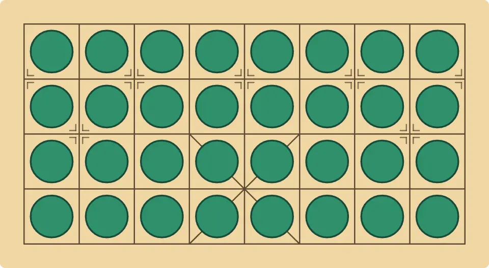

# MistyBanqi

[](https://github.com/brianhliou/misty-banqi/actions/workflows/ci.yml)
[](https://github.com/brianhliou/misty-banqi/releases/latest)
[](LICENSE)

A [Banqi](https://en.wikipedia.org/wiki/Banqi) (Chinese Dark Chess) engine in Rust: αβ search
with **Star1 chance-node expectiminimax** for the hidden-tile flips, a transposition table,
repetition handling, quiescence, and a handcrafted evaluation. Ships as a tiny UCI binary, with
the same search core exposed to Python via PyO3.

Banqi is a hidden-information game: pieces start face-down and flip to reveal during play, so a
move is either a deterministic move/capture or a chance event drawn from the bag of unrevealed
pieces. That mix of decision and chance nodes is the heart of the engine.

<p align="center">
  <a href="https://mistboard.com/?play=computer&gameSpecId=banqi">
    
  </a>
  <br>
  <sub><i>MistyBanqi against itself at full strength (1.5M nodes a move): 100 plies, 21 captures, and Black takes the last red piece off the board.</i></sub>
</p>

**Play it** against the computer on [mistboard.com](https://mistboard.com/?play=computer&gameSpecId=banqi),
where this engine is the Banqi opponent ([rules](https://mistboard.com/rules/banqi)). Full build
report: [Building a Banqi Engine](https://brianhliou.com/posts/building-banqi-engine/).

## Strength

A competent αβ CDC engine, tuned by large-scale paired-deal bakeoffs (every relative gain below is
measured that way). It makes no SOTA claim: it has not played CLAP_CDC, DarkKnight, or other top
programs, so there is no head-to-head result. The part worth reading is how the strength was built.

## How it works

**Search: αβ + Star1 over a mixed decision/chance tree.** A flip is a chance node: the engine
knows only the public bag of remaining pieces, not which one a given tile holds. Star1 takes the
probability-weighted expectiminimax value over bag outcomes with αβ-style bounds (`flip_value` in
[`engine.rs`](banqi_rust/src/engine.rs)), pruning chance branches instead of expanding all ~14.
Decision nodes are ordinary αβ negamax.

**Machinery.** A Zobrist transposition table keyed on (board, bag, side-to-move); repetition
detection with contempt (avoid draws when ahead, seek them when losing) plus a root anti-draw-sac
guard; quiescence over captures; iterative deepening under a node budget, so strength is
CPU-independent (`go nodes N`).

**Evaluation, handcrafted and measured.** Material on a corrected value table, covered-piece
("full-alive") material so a flip never creates phantom value, value-aware mobility,
context-dependent general value, an adaptive *domination* term (a piece is worth more as the
enemies that could capture it dwindle), and a general-safety term.

## Two tuning stories

The engine is competent CDC; how it was tuned is the interesting part.

**Cheap-strength climb (+16.6% win-rate).** Stack handcrafted eval terms, each behind a feature
bit and validated by cloud-scale paired-deal bakeoffs (local 40-game matches are too noisy at
Banqi's ~56% draw rate to see a few-percent edge). The biggest single win was a bug in the value
table: the cannon (the most tactically dominant piece, via screen capture) was undervalued and the
chariot overvalued; fixing the order alone was ~+10%.

**General-safety, and measuring the right thing.** The engine let its general get cornered and
captured. The fix was "make luft": flip a face-down neighbor to give a boxed general a 2×2 escape
before the hunting soldier arrives. Two lessons came out of it. Don't adjudicate a defensive idea
with the engine's own evaluation: if the eval is blind to the danger, asking it "is this move
good?" is circular, so the save was verified by exact analysis and a played-out line. And a
defensive term is invisible to an opponent that can't exploit the weakness: against a baseline that
doesn't hunt generals, win-rate barely moved, so a direct metric ("did we lose our own general?")
was needed to see the real drop (35.5% → 26%).

## Roadmap

Handcrafted αβ has a ceiling: the cheap-eval climb has plateaued, and general-safety bought
robustness over raw strength. The next bet is a learned value network (AlphaZero-style), parked on
compute and engineering. A local self-play de-risk has not yet climbed past the αβ clone, so the
cloud spend is not justified on local evidence alone.

## Build & run

The UCI binary (no Python needed):

```sh
cargo build --release -p banqi-engine
echo "uci" | ./target/release/banqi-engine        # → id name MistyBanqi 0.2.2 ...
```

Drive it over UCI with a Banqi FEN (face-down tile = `X`; turn `r`/`b`/`-`; then the bag and clock):

```
uci
position fen XXXXXXXX/XXXXXXXX/XXXXXXXX/XXXXXXXX - <bag> 0 1
go nodes 1500000
```

The Python bindings (the same search core via PyO3):

```sh
pip install maturin
maturin develop --release -m banqi_rust/Cargo.toml
python -c "import banqi_rust; print([f for f in dir(banqi_rust) if not f.startswith('_')])"
```

The browser build is single-threaded WebAssembly:

```sh
wasm-pack build banqi-wasm --target web --release
```

It exposes one-shot `analyze` plus a stateful `AnalysisSession`. Repeated bounded
`step(nodes)` calls preserve iterative-deepening state, the transposition table, and
move-ordering history while giving the browser a cancellation boundary between slices.

## Layout

```
banqi_rust/      engine core (engine.rs) + PyO3 Python bindings (lib.rs)
banqi-engine/    standalone UCI binary (main.rs; #[path]-includes the core)
banqi-wasm/      wasm-bindgen browser API, including incremental analysis sessions
.github/workflows/  ci (build + uci smoke) and release (tag → published binary)
```

## Acknowledgements

The handcrafted evaluation started from [george0828Zhang/chinese-dark-chess-hw](https://github.com/george0828Zhang/chinese-dark-chess-hw),
which was also the fixed reference opponent the bakeoffs were tuned against. The context-dependent
general value and the value-weighted mobility, in particular, are adapted from it.

## License

MIT, see [LICENSE](LICENSE).
